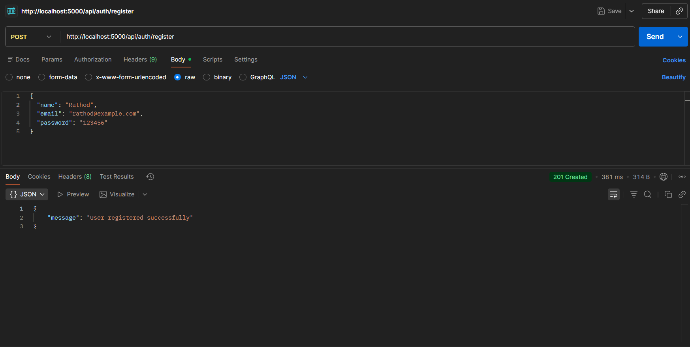
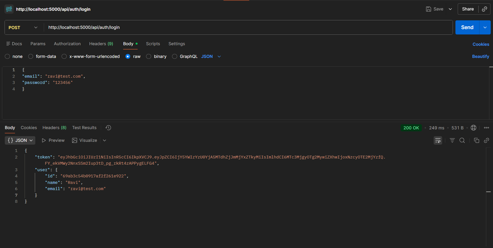
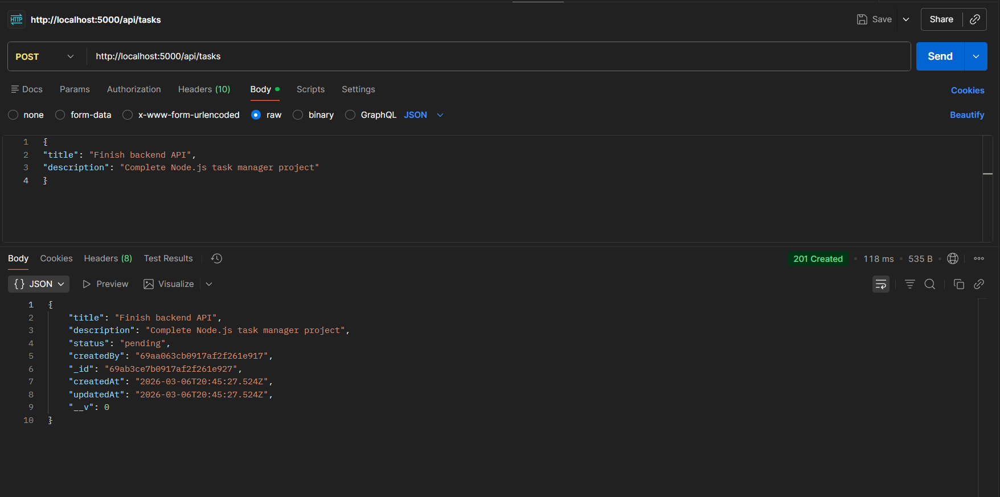
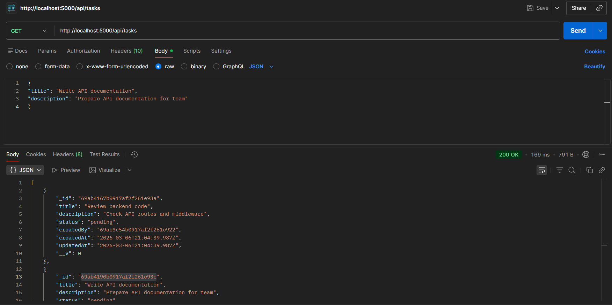
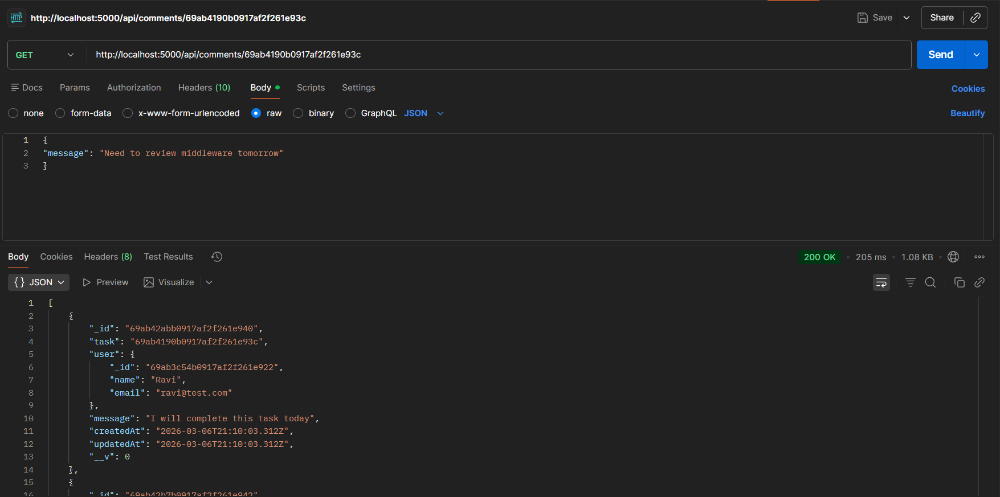

# Task Tracker Backend API

A backend REST API for a task tracking and management application that allows users to create, manage, and track tasks while collaborating through comments.

## Tech Stack

* Node.js
* Express.js
* MongoDB Atlas
* Mongoose
* JWT Authentication
* bcryptjs

## Features

* User Registration
* User Login with JWT Authentication
* Task CRUD Operations
* Task Filtering
* Task Searching
* Comments on Tasks
* Protected Routes using Middleware

## API Endpoints

### Authentication

POST /api/auth/register
POST /api/auth/login

### Tasks

POST /api/tasks
GET /api/tasks
PUT /api/tasks/:id
DELETE /api/tasks/:id

Filtering:

GET /api/tasks?status=completed
GET /api/tasks?status=pending

Search:

GET /api/tasks?search=keyword

### Comments

POST /api/comments/:taskId
GET /api/comments/:taskId

## API Testing Screenshots

### Register API



### Login API



### Post tasks



### Get Tasks



### Get Comment



## Installation

Clone the repository

```
git clone https://github.com/MHKRathod/test-tracker-backend.git
```

Install dependencies

```
npm install
```

Create .env file

```
PORT=5000
MONGO_URI=your_mongodb_connection_string
JWT_SECRET=your_secret_key
```

Run the server

```
nodemon server.js
```

## Folder Structure

```
controllers/
models/
routes/
middleware/
server.js
```

## Author

Hari Krishna Rathod
